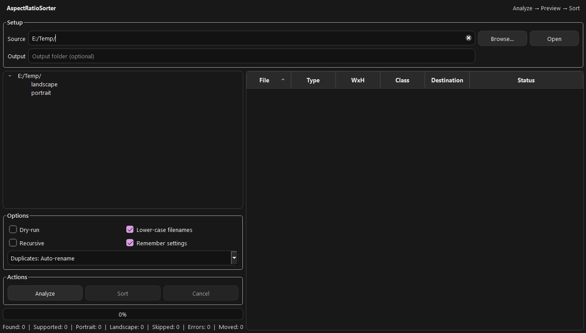

# AspectRatioSorter


Business-style **PyQt6** app that sorts media by aspect ratio into **portrait** / **landscape** folders.



## What it does
- Supported: **.jpg .jpeg .png .mp4 .mov**
- Rule: `width / height < 1` → `portrait`, else → `landscape`
- Workflow: **Analyze → Sort (MOVE)**
- Output behavior:
  - Output empty → creates `portrait/` + `landscape/` directly in **Source**
  - Output set → creates `Source/<Output>/portrait|landscape`

## Package (single EXE)
```powershell
pyinstaller -y --clean --onefile --noconsole --name "AspectRatioSorter" `
  --collect-all "cv2" `
  "AspectRatioSorter.py"
